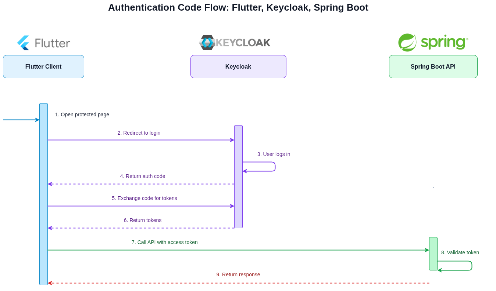
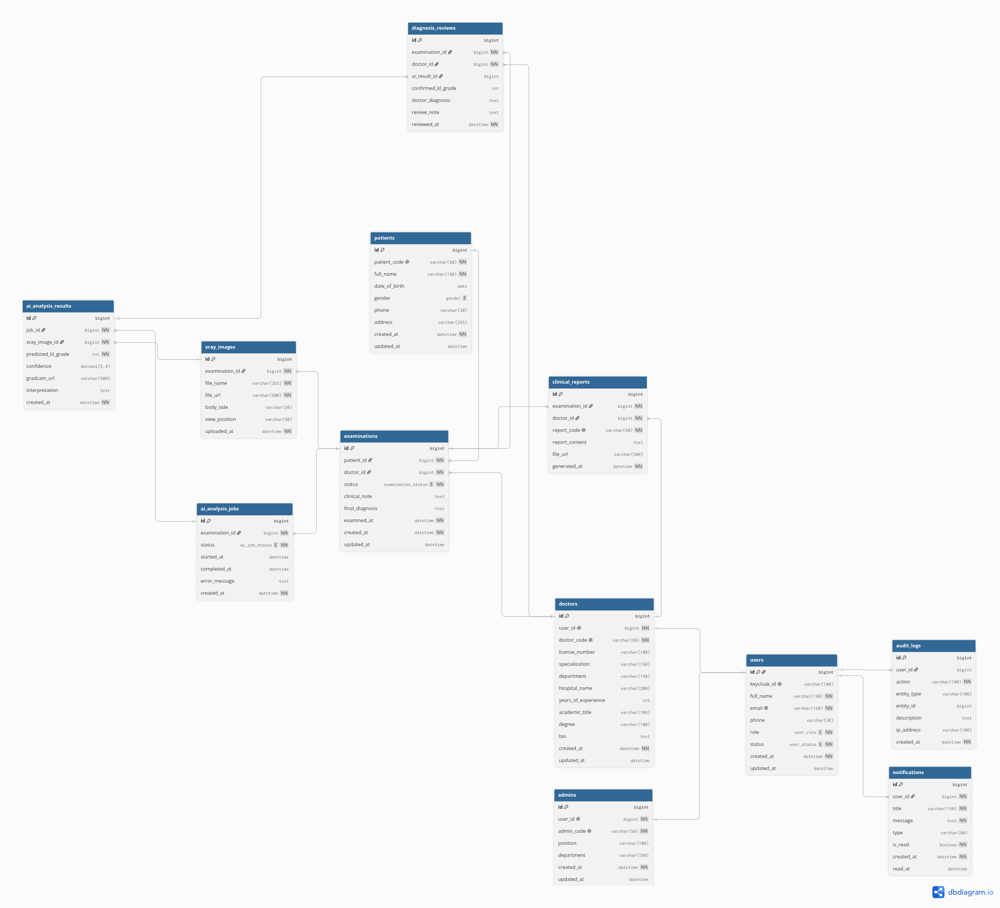

# Backend Service

Spring Boot backend service for the Capstone project.

## Tech Stack

- Java 21
- Spring Boot 4.0.6
- Spring Web MVC
- Spring Data JPA
- MySQL Connector/J
- Maven
- Lombok

## Project Structure

```text
.
├── pom.xml
├── src
│   ├── main
│   │   ├── java/com/g93/be/BeApplication.java
│   │   └── resources/application.yaml
├── docs
│   ├── architecture.md
│   ├── authentication.md
│   ├── development.md
│   ├── environment.md
│   ├── deployment.md
│   ├── testing.md
│   ├── api.md
│   ├── git-flow.md
│   └── diagrams
│       ├── be-architecture.drawio
│       ├── be-architecture.png
│       ├── authentication-workflow.drawio
│       └── authentication-workflow.png
└── HELP.md
```

## Requirements

- JDK 21
- Maven 3.9+

Check your local versions:

```bash
java -version
mvn -version
```

## Getting Started

Run the application locally:

```bash
mvn spring-boot:run
```

By default, Spring Boot starts on port `8080`.

## Configuration

Application configuration lives in `src/main/resources/application.yaml`.

Current configuration:

```yaml
spring:
  application:
    name: be
  datasource:
    url: jdbc:mysql://${DB_HOST:localhost}:${DB_PORT:3306}/${DB_NAME:capstone}
```

Add environment-specific settings through Spring profiles when needed, for example:

```bash
mvn spring-boot:run -Dspring-boot.run.profiles=dev
```

## Build

Compile and package the service:

```bash
mvn clean package
```

The packaged artifact is generated under `target/`.

## Test

Run the test suite:

```bash
mvn test
```

## API Status

No controllers or public API endpoints are currently implemented. Add API documentation under `docs/api.md` as endpoints are introduced.

## Documentation

Project documentation is stored in `docs`:






Read the docs in this order:

1. [Documentation Index](docs/README.md)
2. [Backend Architecture](docs/architecture.md)
3. [Authentication Workflow](docs/authentication.md)
4. [Package Diagram](docs/package-diagram.md)
5. [Development Guide](docs/development.md)
6. [Environment Configuration](docs/environment.md)
7. [Database](docs/database.md)
8. [API Documentation](docs/api.md)
9. [Deployment Guide](docs/deployment.md)
10. [Testing Strategy](docs/testing.md)
11. [Contributing Guide](docs/contributing.md)

Additional assets:

- [Architecture Diagram Source](docs/diagrams/be-architecture.drawio)
- [Architecture Diagram Image](docs/diagrams/be-architecture.png)
- [Authentication Workflow Diagram Source](docs/diagrams/authentication-workflow.drawio)
- [Authentication Workflow Diagram Image](docs/diagrams/authentication-workflow.png)
- [Package Diagram Source](docs/diagrams/package-diagram.drawio)
- [Package Diagram Image](docs/diagrams/package-diagram.png)
- [Git Flow Diagram Source](docs/diagrams/git-flow.drawio)
- [Git Flow Diagram Image](docs/diagrams/git-flow.png)
- [Database ERD Image](docs/diagrams/database.png)
- [Database Schema DBML](docs/database-schema.dbml)

## Documentation Maintenance

When code, configuration, database schema, authentication, deployment, or API behavior changes, update the relevant files under `docs/` and `CHANGELOG.md`.

## Notes

- `target/` contains generated build output and should not be edited manually.
- `HELP.md` is the default Spring Initializr help file and can be kept for framework references.
