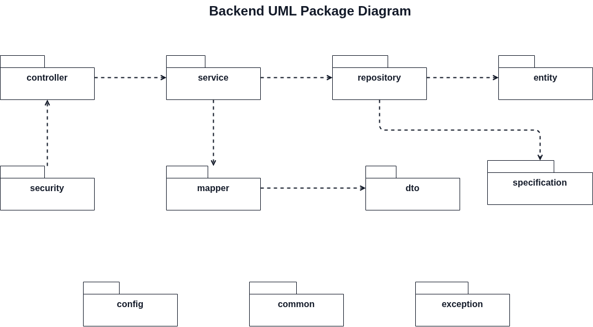

# Documentation

This folder contains backend documentation for the Capstone project.

## Reading Order

1. [Backend Architecture](architecture.md)
2. [Authentication Workflow](authentication.md)
3. [Package Diagram](package-diagram.md)
4. [Development Guide](development.md)
5. [Database](database.md)
6. [API Documentation](api.md)

## Assets

- [Editable Architecture Diagram](diagrams/be-architecture.drawio)
- [Architecture Diagram Image](diagrams/be-architecture.png)
- [Editable Authentication Workflow Diagram](diagrams/authentication-workflow.drawio)
- [Authentication Workflow Image](diagrams/authentication-workflow.png)
- [Editable Package Diagram](diagrams/package-diagram.drawio)
- [Package Diagram Image](diagrams/package-diagram.png)

## Current State

The backend is currently a minimal Spring Boot application with no implemented controllers, persistence layer, external integrations, or API routes.

Keep these docs updated whenever new modules are added, especially when introducing:

- REST controllers
- services and domain logic
- database access
- authentication or authorization
- external integrations
- deployment configuration

## Navigation

- [Back to repository README](../README.md)
- Next: [Backend Architecture](architecture.md)
