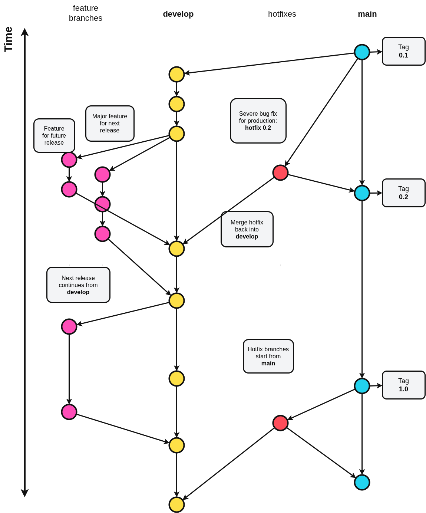

# Documentation

This folder contains backend documentation for the Capstone project.

## Reading Order

1. [Backend Architecture](architecture.md)
2. [Authentication Workflow](authentication.md)
3. [Package Diagram](package-diagram.md)
4. [Standard Git Flow](git-flow.md)
5. [Development Guide](development.md)
6. [Environment Configuration](environment.md)
7. [Database](database.md)
8. [Email Integration](email.md)
9. [API Documentation](api.md)
10. [Deployment Guide](deployment.md)
11. [Testing Strategy](testing.md)
12. [Error Handling](error-handling.md)
13. [Security Guide](security.md)
14. [API Design Guidelines](api-design-guidelines.md)
15. [Code Style](code-style.md)
16. [Database Migration](database-migration.md)
17. [Observability](observability.md)
18. [Runbook](runbook.md)
19. [Release Process](release-process.md)
20. [Contributing Guide](contributing.md)
21. [Architecture Decision Records](adr/README.md)

## Assets

- [Editable Architecture Diagram](diagrams/be-architecture.drawio)
- [Architecture Diagram Image](diagrams/be-architecture.png)
- [Editable Authentication Workflow Diagram](diagrams/authentication-workflow.drawio)
- [Authentication Workflow Image](diagrams/authentication-workflow.png)
- [Editable Package Diagram](diagrams/package-diagram.drawio)
- [Package Diagram Image](diagrams/package-diagram.png)
- [Editable Git Flow Diagram](diagrams/git-flow.drawio)
- [Git Flow Diagram Image](diagrams/git-flow.png)
- [Database Schema DBML](database-schema.dbml)
- [Database ERD Image](diagrams/database.png)

## Current State

The backend is currently a Spring Boot application with MySQL datasource configuration and no implemented public controllers or API routes yet.

Keep these docs updated whenever new modules are added, especially when introducing:

- REST controllers
- services and domain logic
- database access
- authentication or authorization
- external integrations
- deployment configuration

## Maintenance Rule

When code, configuration, database schema, authentication, deployment, or API behavior changes, update the relevant documentation in the same change.

## Navigation

- [Back to repository README](../README.md)
- Next: [Backend Architecture](architecture.md)
