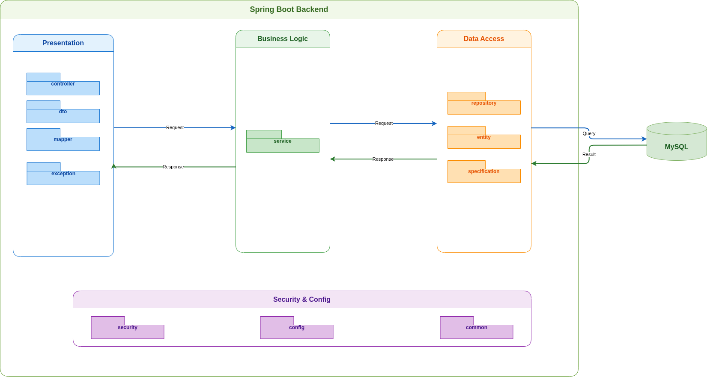

# Backend Architecture

[Back to Documentation Index](README.md) | Next: [Authentication Workflow](authentication.md)

## Overview

The backend is a Spring Boot application using Java 21 and Maven. It follows a modular, layered architecture to support the AI-assisted knee X-ray diagnosis system.



## Runtime Flow

```text
Client request (REST / HTTP)
  -> Spring Security (JWT Authentication Filters)
  -> Spring Web MVC DispatcherServlet
  -> Controller layer (e.g., AuthController, PatientController, NotificationController)
  -> Service layer (Business Logic & Transactions)
  -> Repository layer (Spring Data JPA / Specifications)
  -> Database (MySQL)

Client request (STOMP WebSocket)
  -> Spring WebSocket Message Broker (/api/v1/ws)
  -> WebSocketChannelInterceptor (JWT Token Validation on CONNECT)
  -> STOMP Destinations (/topic or /user/queue)
```

The application now actively exposes various RESTful API endpoints securely under the `/api/v1` context path and supports real-time, authenticated STOMP WebSocket connections.

## Application Entry Point

The application starts from:

```text
src/main/java/com/g93/be/BeApplication.java
```

`@SpringBootApplication` enables component scanning and auto-configuration for classes under the `com.g93.be` package.

## Configuration

The main configuration file is:

```text
src/main/resources/application.yaml
```

Current settings only define the Spring application name:

```yaml
spring:
  application:
    name: be
```

## Suggested Package Layout

Use a feature-oriented or layered package structure as the application grows. A simple starting point is:

```text
com.g93.be
├── controller
├── service
├── repository
├── domain
├── dto
├── config
└── exception
```

## Architecture Diagram

The current architecture diagram is stored in:

```text
docs/diagrams/be-architecture.drawio
docs/diagrams/be-architecture.png
```

Update both the editable `.drawio` file and exported image when the architecture changes.

## Navigation

- [Back to Documentation Index](README.md)
- [Next: Authentication Workflow](authentication.md)
