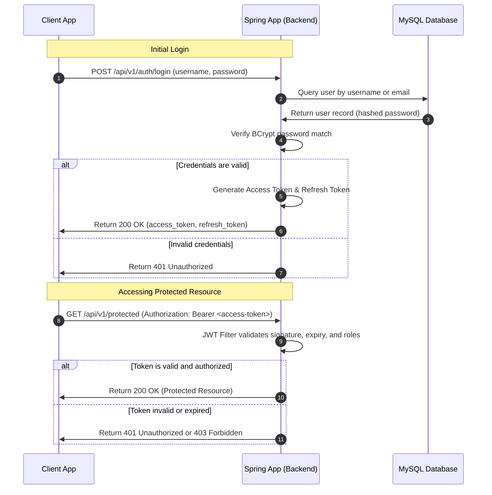

# Authentication Workflow

[Back to Documentation Index](README.md) | Previous: [Backend Architecture](architecture.md) | Next: [Package Diagram](package-diagram.md)

This document describes the direct stateless authentication flow between a client application (Flutter) and the Spring Boot backend using username/password and JSON Web Tokens (JWT).

## Steps

### Login Phase
1. The client sends a login request with `username` (or `email`) and `password` to `/api/v1/auth/login`.
2. The Spring app loads user details, verifies the BCrypt hashed password, and generates JWT access and refresh tokens.
3. The client receives and stores the tokens securely.

### Access Phase
4. The client includes the access token in the `Authorization: Bearer <token>` header of subsequent API requests.
5. Spring Security filters intercept the request, extract the token, and validate its signature and expiry.
6. If the token is valid, Spring populates the Security Context with the user's details and authorities.
7. The API endpoint executes and returns the resource.

## Spring Responsibilities

- **Password Hashing**: Encode user passwords using BCrypt when users register or update their credentials.
- **JWT Generation & Parsing**: Generate secure, signed tokens containing username and roles, and validate them on every API request.
- **Stateless Session Management**: Configure Spring Security to not create HTTP sessions (`SessionCreationPolicy.STATELESS`).
- **Error Handling**: Properly handle authentication entry points to return standard JSON responses for `401 Unauthorized` and `403 Forbidden`.

## Navigation

- [Back to Documentation Index](README.md)
- [Previous: Backend Architecture](architecture.md)
- [Next: Package Diagram](package-diagram.md)
