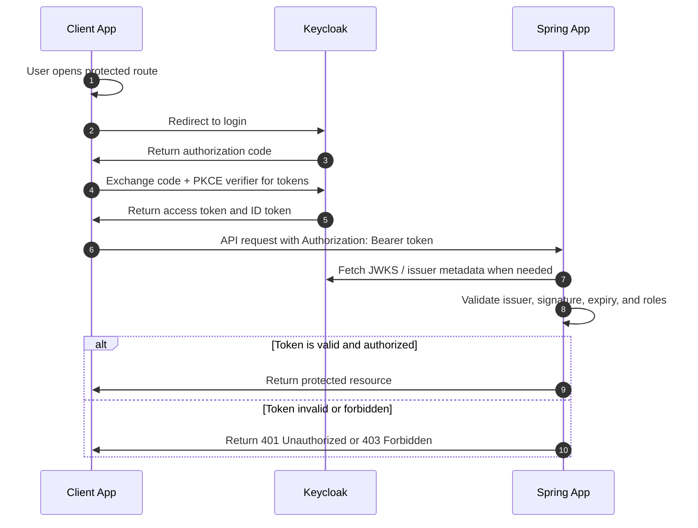

# Authentication Workflow

[Back to Documentation Index](README.md) | Previous: [Backend Architecture](architecture.md) | Next: [Package Diagram](package-diagram.md)

This document describes the expected authentication flow between a client application, Keycloak, and the Spring backend.

The editable draw.io diagram is available at [diagrams/authentication-workflow.drawio](diagrams/authentication-workflow.drawio).

## Steps

1. The client opens a protected route or sends a request that requires authentication.
2. The client redirects the user to Keycloak for login.
3. Keycloak authenticates the user and issues tokens.
4. The client sends API requests to the Spring app with `Authorization: Bearer <access-token>`.
5. The Spring app validates the JWT using Keycloak issuer metadata and signing keys.
6. The Spring app returns the protected resource, `401 Unauthorized`, or `403 Forbidden`.

## Spring Responsibilities

- Validate JWT issuer, signature, expiry, and audience when configured.
- Map token roles or claims to Spring Security authorities.
- Reject missing, expired, invalid, or insufficiently privileged tokens.
- Keep business endpoints independent from Keycloak login UI concerns.

## Navigation

- [Back to Documentation Index](README.md)
- [Previous: Backend Architecture](architecture.md)
- [Next: Package Diagram](package-diagram.md)
