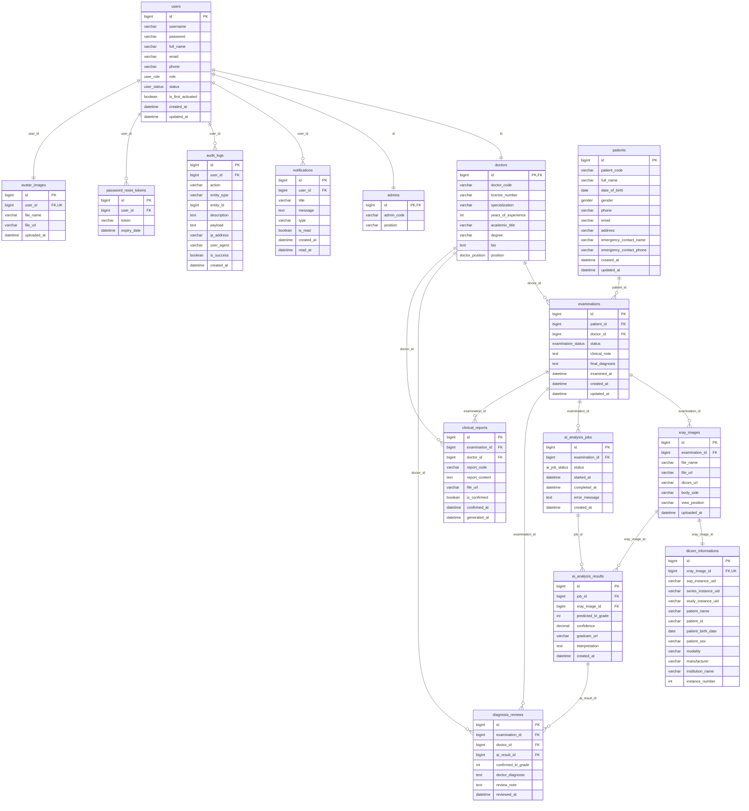

# Database

[Back to Documentation Index](README.md) | Previous: [Environment Configuration](environment.md) | Next: [API Documentation](api.md)

The backend uses MySQL for persistence. Local development runs MySQL through Docker Compose from the backend folder.

## Database ERD


### Live Mermaid ERD Diagram



## Docker Compose

The Compose file is located in the backend folder:

```text
docker-compose.yaml
```

The MySQL service uses this image:

```text
dhi.io/mysql:9
```

The DBML source used to generate the database diagram is available at:

```text
docs/database-schema.dbml
```

Environment files are stored in:

```text
../env/database.env
../env/be.env
```

## Start Database

From `/home/viet/Capstone/be`:

```bash
docker compose up -d mysql
```

Check service status:

```bash
docker compose ps
```

Stop services:

```bash
docker compose down
```

Stop services and remove the MySQL volume:

```bash
docker compose down -v
```

## Spring Configuration

The backend database settings are defined in:

```text
src/main/resources/application.yaml
```

The app reads these environment variables:

- `DB_HOST`
- `DB_PORT`
- `DB_NAME`
- `DB_USERNAME`
- `DB_PASSWORD`

Local defaults use the MySQL root user because the configured `dhi.io/mysql:9` image initializes root credentials but does not create an application user from `MYSQL_USER` / `MYSQL_PASSWORD`.

## Run Backend With Env File

From `/home/viet/Capstone/be`:

```bash
set -a && source ../env/be.env && set +a && mvn spring-boot:run
```

## Connection Check

`spring-boot-starter-data-jpa` and the MySQL JDBC driver are included so the application opens a datasource connection during startup.

## Proposed Schema

The proposed database schema is documented in DBML format for dbdiagram/dbdraw:

```text
docs/database-schema.dbml
```

Use this file to generate the ERD visually in a DBML-compatible diagram tool.

## JPA Entities and Inheritance Mapping

The project maps tables to JPA Entities under `com.g93.be.entity` and repositories under `com.g93.be.repository`.

### User & Authentication Inheritance (JOINED Strategy)
To avoid duplicating fields (like timestamps and user properties) while preserving a clean relational structure, the database uses the **JPA JOINED inheritance strategy**:

* **`User`** (`com.g93.be.entity.User`): The parent entity mapping to the `users` table. Contains shared account credentials, profile details (`avatar_url`), audit status, and audit timestamps.
* **`Doctor`** (`com.g93.be.entity.Doctor`): Extends `User` mapping to the `doctors` table via `@PrimaryKeyJoinColumn(name = "id")`. Contains clinical details.
* **`Admin`** (`com.g93.be.entity.Admin`): Extends `User` mapping to the `admins` table via `@PrimaryKeyJoinColumn(name = "id")`. Contains administrative configuration.

### Notification and Audit Logging
* **`Notification`** (`com.g93.be.entity.Notification`): Maps to `notifications` with a lazy reference (`@ManyToOne`) back to the `User`.
* **`AuditLog`** (`com.g93.be.entity.AuditLog`): Maps to `audit_logs`. It tracks security context fields including `user_agent`, client `ip_address`, transaction `payload` (JSON), and execution `is_success`.

### Clinical Reporting, Reviews & Metadata
* **`DiagnosisReview`** (`com.g93.be.entity.DiagnosisReview`): Maps to `diagnosis_reviews`. Stores the doctor's clinical review and validation of AI-predicted KL grades and details.
* **`ClinicalReport`** (`com.g93.be.entity.ClinicalReport`): Maps to `clinical_reports`. Stores generated/exported clinical PDF reports, utilizing `is_confirmed` and `confirmed_at` to represent the doctor's confirmation.
* **`DicomInformation`** (`com.g93.be.entity.DicomInformation`): Maps to `dicom_informations` (linked 1-to-1 with `XrayImage`). Stores parsed DICOM metadata tags (Patient ID, Name, Birth Date, Sex, SOP Instance UID, etc.) for uploaded files.

---

## Navigation

- [Back to Documentation Index](README.md)
- [Previous: Environment Configuration](environment.md)
- [Next: API Documentation](api.md)

