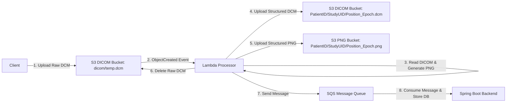

# DICOM to PNG Processing Pipeline Documentation

This document describes the design, architecture, file directory structures, and JSON SQS message schemas for the DICOM image processor pipeline.

## Pipeline Overview

The pipeline utilizes AWS serverless resources to process uploaded raw DICOM (`.dcm`) medical imaging files, parse their metadata, extract the visual data into web-previewable PNG files, and notify the backend application via SQS queue.



---

## Storage & Directory Layout (S3)

The pipeline separates raw DICOM files from processed preview PNGs using two distinct buckets:
- **DICOM Storage Bucket**: `healthsync-dicom-<env>-<account_id>-<region>-an`
- **PNG Preview Bucket**: `healthsync-png-<env>-<account_id>-<region>-an`

Both buckets leverage the native `bucket_namespace = "account-regional"` configuration to auto-generate unique names and avoid global namespace collisions.

### Folder Structure Pattern
All processed files are stored in a structured path according to the Patient ID and the imaging Study session:

```text
<patient_id>/<study_instance_uid>/<body_part_position>_<epoch_timestamp>.<ext>
```

- **`<patient_id>`**: Extracted from DICOM tag `PatientID` (0010,0020). Characters other than alphanumeric, `.`, and `-` are sanitized to `_`.
- **`<study_instance_uid>`**: Extracted from DICOM tag `StudyInstanceUID` (0020,000D). This groups all images taken in the same clinical imaging session into a single folder.
- **`<body_part_position>`**: Extracted from `BodyPartExamined` (0018,0015) or `ViewPosition` (0018,5101) (fallbacks to `image`).
- **`<epoch_timestamp>`**: Seconds since UNIX epoch to prevent filename collisions when multiple images of the same body part are taken in a single study.

---

## JSON Payload Schema (SQS Message)

Upon successful processing, the Lambda function publishes a message to SQS. The backend consumes this message and maps it to a database entity.

### JSON Structure

```json
{
  "dicom_file": {
    "bucket": "string (The DICOM S3 bucket name)",
    "key": "string (The structured S3 key to the .dcm file)"
  },
  "png_file": {
    "bucket": "string (The PNG S3 bucket name)",
    "key": "string (The structured S3 key to the .png file)"
  },
  "metadata": {
    "PatientID": "string",
    "PatientName": "string",
    "StudyInstanceUID": "string",
    "SeriesInstanceUID": "string",
    "SOPInstanceUID": "string",
    "BodyPartExamined": "string",
    "ViewPosition": "string",
    "StudyDate": "string",
    "StudyTime": "string",
    "Modality": "string",
    "Rows": "string",
    "Columns": "string",
    "BitsStored": "string",
    "WindowCenter": "string",
    "WindowWidth": "string",
    "...": "string (Other extracted DICOM attributes)"
  }
}
```

---

## Extracted DICOM Attributes Reference

The `metadata` dictionary is populated by parsing the DICOM attributes from the file.
> [!IMPORTANT]
> To optimize message sizes and keep the SQS payload well below the 256 KB limit, **the heavy binary `PixelData` tag (0x7FE00010) is explicitly skipped** during metadata extraction.

The following table details the key tags extracted by the Lambda and their purpose in the database:

| DICOM Tag ID | Attribute Name | Typical Value | Purpose / Mapping |
| :--- | :--- | :--- | :--- |
| `(0010,0020)` | `PatientID` | `2600053671` | Identifies the Patient. Used for S3 parent directory name. |
| `(0010,0010)` | `PatientName` | `VU THI KIM LIEN` | Name of the Patient. |
| `(0020,000D)` | `StudyInstanceUID` | `2.25.2863930912420...` | Identifies the clinical study session. Used for S3 subdirectory name. |
| `(0020,000E)` | `SeriesInstanceUID` | `1.2.392.200046.100...` | Identifies the specific series in the study. |
| `(0008,0018)` | `SOPInstanceUID` | `1.2.392.200046.100...` | Identifies the specific image (Instance). Database unique key. |
| `(0018,0015)` | `BodyPartExamined` | `KNEE` | The body part imaged (e.g. KNEE, CHEST, LUNG). Used for S3 filename. |
| `(0018,5101)` | `ViewPosition` | `AP` | Image perspective (AP, PA, LATERAL, etc.). |
| `(0008,0020)` | `StudyDate` | `20260602` | Date of the study (`YYYYMMDD`). |
| `(0008,0030)` | `StudyTime` | `092706.760` | Time of the study (`HHMMSS.SSS`). |
| `(0008,0060)` | `Modality` | `DX` | Digital Radiography, Computed Radiography, etc. |
| `(0028,0010)` | `Rows` | `2688` | Image height in pixels. |
| `(0028,0011)` | `Columns` | `2008` | Image width in pixels. |
| `(0028,0101)` | `BitsStored` | `12` | Actual color depth (important for medical displays and AI modeling). |
| `(0028,1050)` | `WindowCenter` | `2048` | Default display brightness (VOI LUT configuration). |
| `(0028,1051)` | `WindowWidth` | `4096` | Default display contrast (VOI LUT configuration). |

---

## Local Verification Commands

1. **Rebuild the Lambda package**:
   ```bash
   mvn clean package -f infra/lambda/dicom-processor/pom.xml
   ```
2. **Validate Terraform integration**:
   ```bash
   cd infra/terraform/live/dev
   terraform init -backend=false
   terraform validate
   ```
